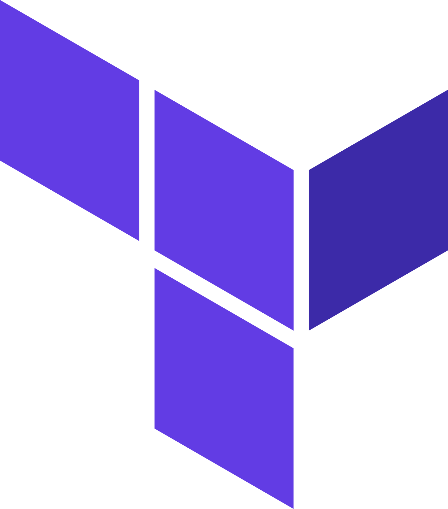

<html>

# Hello, my name is Lucas Bedatty! 

- 🔭 I’m currently working on <a href="https://www.caf.io/">Caf.io</a>
- 🌱 I’m currently learning Cloud architecture solutions
- 🎓 Graduated in <a href="http://www.ifsul.edu.br/">Computer Technician Integrated into High School</a>
- 🎓 Graduating in <a href="https://www.unopar.com.br/">Systems Analysis and Development</a>

## Contacts

## Ferramentas e Tecnologias
#### Versionamento

    
    
    

 

#### Cloud Providers

    
    
    
    

 

#### IaC & Automation

    
    
    

 

#### Linux

    
    
    

 

#### Containerization / CI-CD

    
    
    

 

#### DBs

    
    
    
    

 
 

    
        
        
    

</html>
