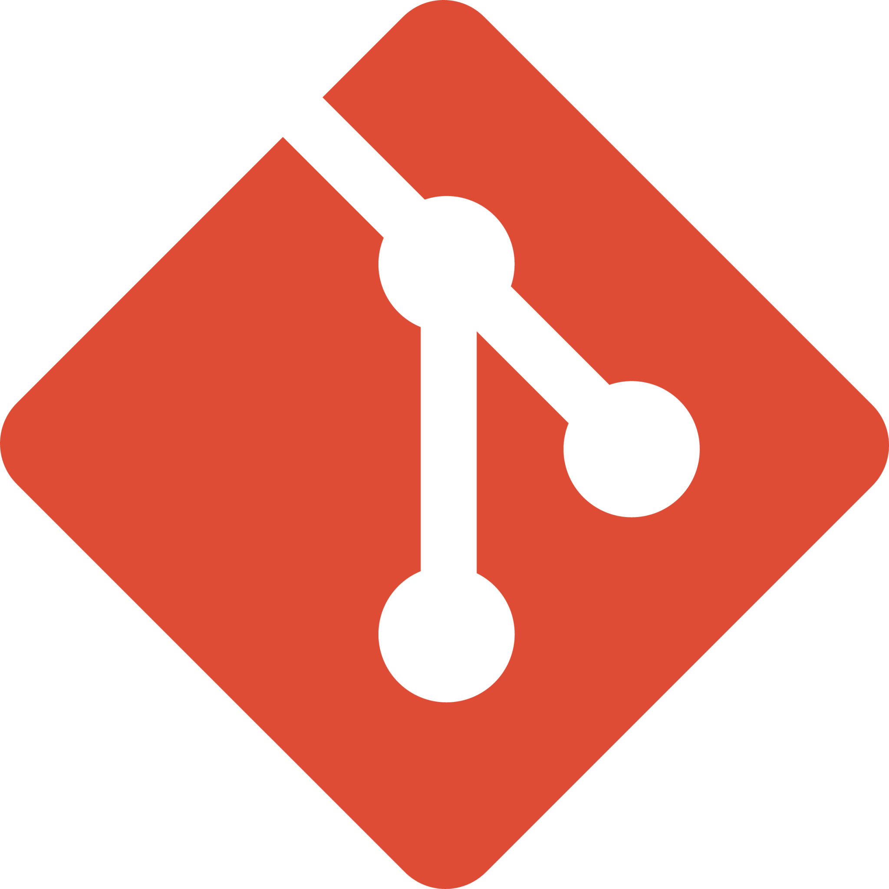
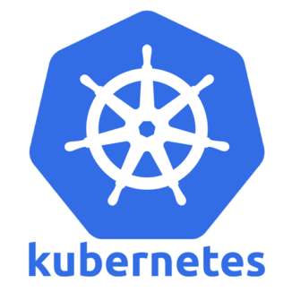

# Hello, my name is Lucas Bedatty!

- 🔭 I’m currently working on [Caf.io](https://www.caf.io/)
- 🌱 I’m currently learning Cloud architecture solutions
- 🎓 Graduated in [Computer Technician Integrated into High School](http://www.ifsul.edu.br/)
- 🎓 Graduating in [Systems Analysis and Development](https://www.unopar.com.br/)

## Contacts

## Ferramentas e Tecnologias

### Versionamento

  
  
  

### Cloud Providers

  
  
  
  

### IaC & Automation

  
  
  

### Linux

  
  

### Containerization / CI-CD

  
  
  

### DBs

  
  
  
  

---

    
        
        
    

